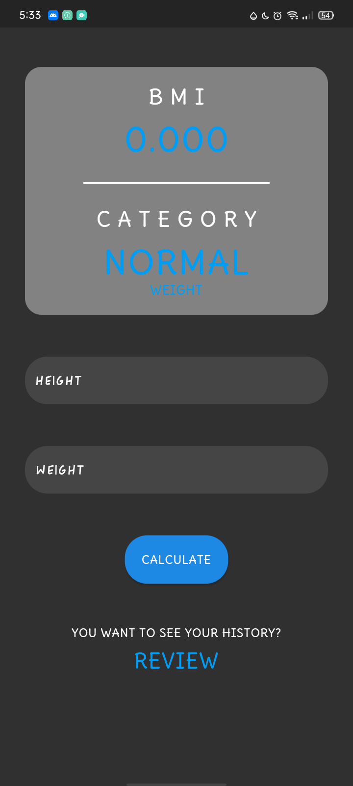
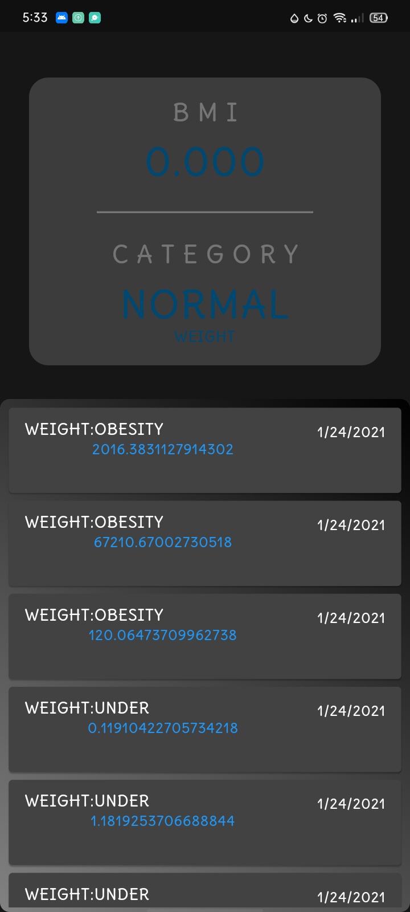
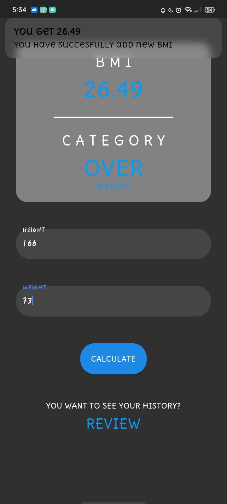

# BMI Calculator

I created this bmi calculator for my personal project  and practice coding and for fun!(Hope you like it). with backend(sqflite)

Screenshots:
 

Package I Used:
    
  google_fonts: ^1.1.1
   
  get: ^3.24.0
   
  path_provider: ^1.6.27 //this is not neccessary dart has its own dart:io package to locate the path of database
   
  sqflite: ^1.3.2+2
